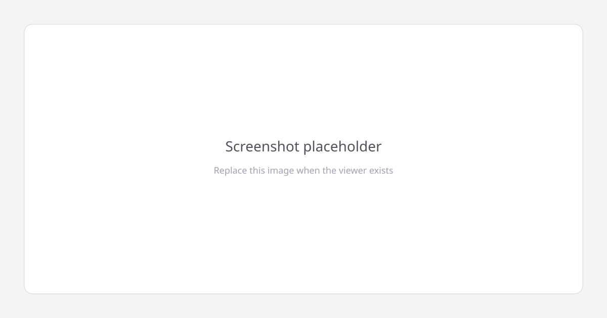

# Fly Brain for Classrooms

Neurofly is a public, classroom-scale viewer for one small circuit in the fruit fly brain. The wiring is real: it comes from the Janelia MaleCNS v1.0 connectome. The app keeps the science checkable by students and teachers, and it keeps the heavy neuron data out of git so the repository stays something a stranger can clone.



## Run locally

```bash
pnpm install
uv sync --directory tools/data
pnpm data:fetch
pnpm dev
```

Node is pinned in `.nvmrc` (22.22.3). Python is 3.12, managed with uv. `pnpm data:fetch` reads `data.lock.json` and downloads the baked assets for that `data-vN` GitHub Release into `apps/web/public/data/`, checking sha256 as it goes. That directory is gitignored. On Day 0 the lock file lists no files, so the command succeeds and downloads nothing.

## How it works

MaleCNS data is cut down to a subcircuit, simulated with a leaky integrate-and-fire (LIF) model, and shown in the viewer: data → subcircuit → LIF sim → viewer.

## What's real and what's simplified

<!-- TODO: written on Day 6 -->

## Credits

Neuron data is MaleCNS v1.0 from [HHMI Janelia FlyEM](https://www.janelia.org/project-team/flyem), the [University of Cambridge](https://www.zoo.cam.ac.uk/), the [MRC Laboratory of Molecular Biology](https://www2.mrc-lmb.cam.ac.uk/), and [Google Research](https://research.google/). The dataset is CC BY 4.0. See [DATA_LICENSE.md](DATA_LICENSE.md).

> Berg, S., Beckett, I. R., Costa, M., Schlegel, P., Januszewski, M., et al. (2026). Sexual dimorphism in the complete _Drosophila_ male central nervous system connectome. _Cell_ 189, 5504–5526.e15. https://doi.org/10.1016/j.cell.2026.08.015

## Built with

- [Next.js](https://nextjs.org/)
- [Three.js](https://threejs.org/)
- [Tailwind CSS](https://tailwindcss.com/)
- [Vercel](https://vercel.com/)

The Vercel project deploys the free `*.vercel.app` hostname. There is no custom domain. The build command is `pnpm data:fetch && pnpm build`.

Nothing else is reused yet. If a later day vendors or forks another project (for example a WebGPU fly viewer), name it here with its license.
