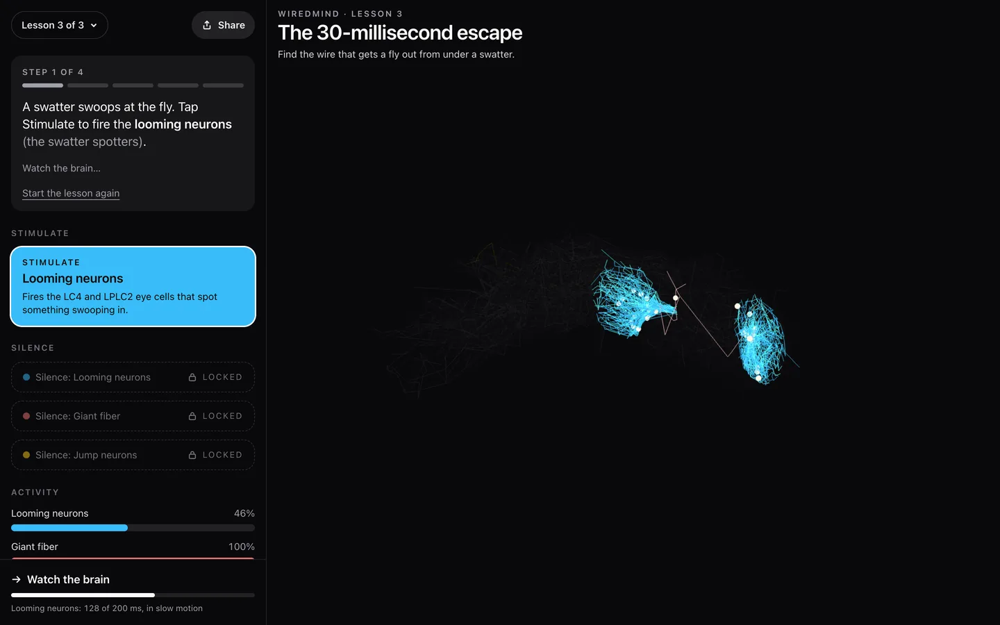

# WiredMind

Free classroom lessons on the real wiring of a fruit fly's nervous system. Students stimulate and silence neurons from the MaleCNS connectome in the browser, with no install and no login.

**[wiredmind-edu.vercel.app](https://wiredmind-edu.vercel.app)** · [What's real and what's simplified](#whats-real-and-whats-simplified) · [Roadmap and good first issues](#roadmap--good-first-issues)



Three short lessons run on three circuits cut from the Janelia MaleCNS v1.0 connectome: how a fly remembers a smell, how it knows which way it's facing, and how it escapes a swatter in 30 milliseconds. The wiring is real. The activity is a deliberately simple simulation, and [the section below](#whats-real-and-whats-simplified) says exactly where that line falls. The app keeps the science checkable by students and teachers, and it keeps the heavy neuron data out of git so the repository stays something a stranger can clone.

## Run locally

```bash
pnpm install
uv sync --directory tools/data
pnpm data:fetch
pnpm dev
```

Node is pinned in `.nvmrc` (22.22.3). Python is 3.12, managed with uv. `pnpm data:fetch` reads `data.lock.json` and downloads the baked assets for that `data-vN` GitHub Release into `apps/web/public/data/`, checking sha256 as it goes, then bakes the landing page loop from them. That directory is gitignored. If you already have the circuit files, `pnpm data:cascade` rebakes only the loop.

`uv run --directory tools/data make-data` rebuilds those assets from the MaleCNS flat files in `tools/data/raw/` (also gitignored). The publish command is in [tools/data/release.md](tools/data/release.md).

## How it works

MaleCNS data is cut down to a subcircuit, simulated with a leaky integrate-and-fire (LIF) model, and shown in the viewer: data → subcircuit → LIF sim → viewer.

| Page                    | What it is                                                                                 |
| ----------------------- | ------------------------------------------------------------------------------------------ |
| `/`                     | Landing page: an 8-second loop of the escape lesson's first swatter, the lessons, teachers |
| `/modules/smell-memory` | Lesson 1, "How a fly remembers a smell" (olfactory circuit)                                |
| `/modules/compass`      | Lesson 2, "How a fly knows which way it's facing" (compass circuit)                        |
| `/modules/escape`       | Lesson 3, "The 30-millisecond escape" (giant fiber circuit)                                |
| `/about`                | What's real and what's simplified, who made it, and how to support it                      |

`tests/lesson-science.test.ts` runs each lesson's steps on the real circuits and checks what the copy says lights up, moves, or goes dark. `tests/about-science.test.ts` checks the numbers the about page quotes against the same data. Both skip until `pnpm data:fetch` has run.

The Share button copies a replay link. Its `?r=` parameter is base64url for the lesson id, the noise seed, and each button press with the simulator tick it landed on, so opening the link repeats the same spikes. Links made before the landing page pointed at `/?r=`; those redirect to the lesson.

The landing loop is baked, not recorded. `scripts/cascade-bake.ts` reads the escape circuit, draws each neuron's centerline the way the viewer does, runs the escape lesson's first stimulus on the lesson's seed, and writes the first 64 ms of spikes to `escape-cascade.json` (about 45 KB compressed) next to the circuit files. The page plays it on a 2D canvas at 100 times slower than life, holds still for readers who prefer reduced motion, and pauses off screen.

Everything under `/data/` is served with a one-year immutable cache. The viewer asks for each circuit file with `?v=<data release>`, and the landing page asks for the loop with a hash of its contents, so new data is always a new URL.

## What's real and what's simplified

WiredMind is a teaching tool, not a research model. If you know the fly literature, this is the section to read before you trust or reuse anything here. The same account, in plainer words, is on the [about page](https://wiredmind-edu.vercel.app/about).

**Real**

- **Neurons and cell types.** Every neuron is a reconstructed body from [MaleCNS v1.0](https://male-cns.janelia.org/), with the cell type its authors assigned. Only typed neurons are used; glia and fragments are excluded. The cuts hold 4,500 (smell), 4,000 (compass), and 3,000 (escape) neurons.
- **Synapse counts.** Each connection's weight is the number of synapses the dataset reports between the two neurons, from the `minconf-0.5` connectome table (synapse detection confidence 0.5 or above).
- **Transmitter signs.** A neuron's consensus transmitter prediction signs all of its outputs: acetylcholine +1, GABA and glutamate −1, and everything else (dopamine, serotonin, octopamine, unclear) 0, so those synapses do nothing.
- **Shapes and positions.** Neurons are drawn from their SWC skeletons in dataset coordinates.

**Simplified**

- **Pruned subcircuits of 3,000 to 4,500 neurons.** Seeds and hop counts are in [tools/data/seeds.yaml](tools/data/seeds.yaml). The smell cut is its four seed populations only (ORNs, antennal lobe PNs, Kenyon cells, MBONs), capped at 4,500 by taking each population's most strongly connected cells in turn. The compass cut (ring neurons, E-PG, P-EN, P-EG, EL) and the escape cut (DNp01, the giant fiber) grow two hops out and keep the most strongly connected partners. Connections with fewer than 5 synapses are dropped. Everything outside a cut is gone, including inhibition that would normally balance it.
- **Uniform leaky integrate-and-fire point neurons.** One parameter set for every cell, the published values of [Shiu et al. 2024](https://doi.org/10.1038/s41586-024-07763-9): rest and reset −52 mV, threshold −45 mV, τ<sub>m</sub> 20 ms, τ<sub>syn</sub> 5 ms, 2.2 ms refractory period, 1.8 ms axonal delay, 0.275 mV per synapse, 0.1 ms steps ([apps/web/src/sim/params.ts](apps/web/src/sim/params.ts)). There is no dendritic computation, no graded or non-spiking neurons, no neuromodulation, and no plasticity.
- **No gap junctions.** The connectome records chemical synapses only, so the model has no electrical synapses. This matters most in the escape lesson: in a real fly the giant fiber's connection to the jump motor neuron (TTMn) is a mixed synapse that leans heavily on gap junctions. Here that link is its 90 chemical synapses.
- **Nothing learns.** The smell lesson shows where odor memories are stored, at the Kenyon cell to MBON synapses, but its cut has no dopaminergic neurons, no APL neuron, and no learning rule, so those weights never change.
- **Idealized stimulation.** Stimulate drives every neuron in a group with independent Poisson input (40 Hz for 200 ms in the smell and escape lessons, 60 Hz for 800 ms on the P-EN2 turn neurons), and every event crosses threshold (W<sub>syn</sub> × 250, as in Shiu et al.), much like optogenetic activation. The lesson's smell is all 1,861 ORNs in the cut at once, not an odor-specific receptor pattern. The swatter is all 304 LC4 and LPLC2 cells at once, not recruitment that follows a growing looming object.
- **Silence is a hard clamp.** Silenced neurons are held at rest and send nothing, Shiu et al.'s removal of outgoing synapses. Genetic tools such as Kir2.1 or tetanus toxin are partial and slower, and tetanus toxin leaves gap junctions working.
- **Compass landmarks.** The ring neurons receive no visual input in the model. Silencing them removes their GABAergic inhibition of the E-PG compass neurons, which is what lets the bump drift in the lesson.
- **Timing.** Latencies come out of the uniform delay and time constants and were not fitted to recordings. The viewer advances 0.2 to 2 ms of fly time per frame, depending on the device, and stops simulating 150 ms after the last stimulus, because some cuts have excitatory loops that would otherwise reverberate without the inhibition left outside. The landing loop plays the first 64 ms of the escape 100 times slower than life.
- **Drawings, not morphology.** Each neuron is a 12-point line through its skeleton. Flashes mark spikes; the moving dots are illustration, not conduction.

**What a research tool would do differently**

- Simulate the whole central nervous system, or cut it on principled boundaries with modeled inputs, keep weak connections, and test how much the cut changes the result.
- Fit parameters by cell type to electrophysiology, model graded and non-spiking neurons, and use conductance-based or multi-compartment models where dendrites matter.
- Add gap junctions from other data, neuromodulators such as dopamine and octopamine, and plasticity, for example dopamine-gated depression at Kenyon cell to MBON synapses.
- Drive sensory neurons with realistic input: odor-specific receptor patterns, and looming stimuli that recruit LC4 and LPLC2 as the object expands.
- Treat transmitter predictions and weights as uncertain, sweep them, run many seeds, and validate against recordings and behavior.

To go deeper, query the dataset in [neuPrint](https://neuprint.janelia.org/?dataset=male-cns%3Av1.0) (dataset `male-cns:v1.0`), read [the MaleCNS paper](https://doi.org/10.1016/j.cell.2026.08.015), and see [Shiu et al. 2024](https://doi.org/10.1038/s41586-024-07763-9) for the whole-brain LIF model these parameters come from.

## Roadmap / good first issues

Read [CONTRIBUTING.md](CONTRIBUTING.md) first. Any change to lesson copy has to pass the science tests on the real circuits.

**Good first issues**

- **Put the brain dorsal side up in the viewer.** MaleCNS y grows ventrally, so the viewer's default camera (`placeCamera` in [apps/web/src/viewer/scene.tsx](apps/web/src/viewer/scene.tsx)) shows the nervous system upside down. The landing loop already uses a dorsal-up view (`VIEW` in [apps/web/src/site/cascade-scene.ts](apps/web/src/site/cascade-scene.ts)).
- **Test the order of the smell lesson's step 2.** The copy says receptors fire, then projection neurons, then Kenyon cells. Add a check to [tests/lesson-science.test.ts](tests/lesson-science.test.ts) that the first spikes arrive in that order.
- **Add a web app manifest** (`apps/web/app/manifest.ts`) so classroom tablets can add WiredMind to the home screen.
- **Keyboard shortcuts for lessons,** such as a key that presses the cued button and one for Next, in [apps/web/src/viewer/module-runner.tsx](apps/web/src/viewer/module-runner.tsx).
- **A printable teacher sheet for each lesson,** built from the steps and check question in [apps/web/content/modules/](apps/web/content/modules/).

**Roadmap**

- **Translations.** Hebrew is next, with a right-to-left layout. Site text lives in [apps/web/src/site/copy.ts](apps/web/src/site/copy.ts) and lesson text in [apps/web/content/modules/](apps/web/content/modules/).
- **Learning in the smell circuit.** Add dopaminergic neurons to the cut and a dopamine-gated Kenyon cell to MBON rule, so the model remembers instead of only showing where memory lives.
- **Gap junctions for the escape circuit,** with a conductance taken from giant fiber recordings.
- **Offline classrooms.** Cache the data release in a service worker for schools with patchy Wi-Fi.
- **More circuits,** such as CO₂ avoidance or courtship song.
- **A WebGPU simulator** behind `SIM_WEBGPU_ENABLED`, if larger cuts need it. [docs/NOTES-webgpu-fly.md](docs/NOTES-webgpu-fly.md) has notes.

## Credits

Neuron data is MaleCNS v1.0 from [HHMI Janelia FlyEM](https://www.janelia.org/project-team/flyem), the [University of Cambridge](https://www.zoo.cam.ac.uk/), the [MRC Laboratory of Molecular Biology](https://mrclmb.ac.uk/), and [Google Research](https://research.google/). The dataset is CC BY 4.0. See [DATA_LICENSE.md](DATA_LICENSE.md).

> Berg, S., Beckett, I. R., Costa, M., Schlegel, P., Januszewski, M., et al. (2026). Sexual dimorphism in the complete _Drosophila_ male central nervous system connectome. _Cell_ 189, 5504–5526.e15. https://doi.org/10.1016/j.cell.2026.08.015

The simulator uses the neuron model and parameters of Shiu, P. K., et al. (2024). A _Drosophila_ computational brain model reveals sensorimotor processing. _Nature_ 634, 210–219. https://doi.org/10.1038/s41586-024-07763-9

Built by [Guy Dahan](https://guy-dev.com). The code is MIT licensed; see [LICENSE](LICENSE). WiredMind is free and always will be. If it helped your class, [coffee keeps the server humming](https://buymeacoffee.com/guydahn).

## Built with

- [Next.js](https://nextjs.org/)
- [Three.js](https://threejs.org/)
- [Tailwind CSS](https://tailwindcss.com/)
- [Vercel](https://vercel.com/)

The Vercel project deploys to the free `wiredmind-edu.vercel.app` hostname. There is no custom domain. The build command is `pnpm data:fetch && pnpm build`. Page views are counted with Vercel Web Analytics, which sets no cookies.

Some internal names still carry the project's working title, Neurofly: the `NFLY` header in `graph.bin` and the `neurofly_data` Python package. Renaming them would break the published `data-v1` files.

No other code is vendored. [docs/NOTES-webgpu-fly.md](docs/NOTES-webgpu-fly.md) records what in [abgnydn/webgpu-fly](https://github.com/abgnydn/webgpu-fly) (MIT) is worth porting later. That kernel was not copied.
